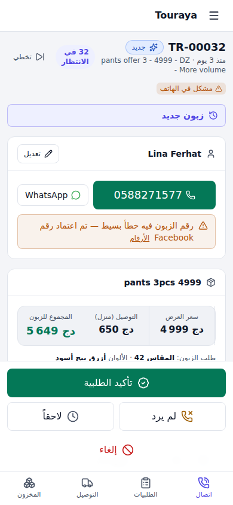
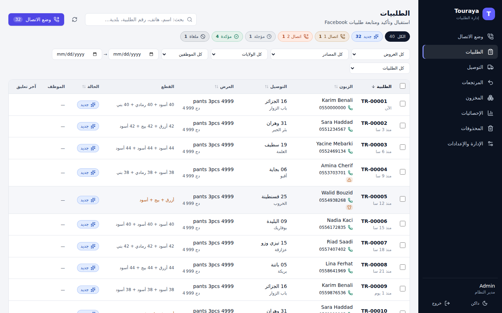

# Touraya CRM — منصة الدفع عند الاستلام (COD) للجزائر

منصة متكاملة لاستقبال الطلبيات (Facebook Lead Ads، المواقع، أي فورم)، تأكيدها بالاتصال، إدارة المخزون والمرتجعات، وإرسالها لشركات التوصيل — مصممة للعمل من الهاتف أولاً، وقابلة للتوسع نحو وكيل AI يؤكد الطلبيات تلقائياً.

<p>
  
  
</p>

- **[مشاكل COD في الجزائر وحلولها في المنصة](docs/COD-PLAYBOOK.md)**
- **[البنية التقنية، نقاط التوسع، خطة الوكيل الذكي، والاستضافة المجانية](docs/ARCHITECTURE.md)**
- **[تجربة المنصة أونلاين + خطة الاختبار خطوة بخطوة](docs/DEPLOY.md)**

## المسار

```
Facebook Forms → شيتات في مجلد Drive → سكريبت واحد ─┐
موقع / Make / Zapier / Shopify → Webhook ───┤
                                            ▼
     الفورم (يُكتشف تلقائياً، مربوط بعرض) ← المنتج · الكمية · السعر
     معالجة: هاتف · ولاية/بلدية (حتى الأسئلة المرتبطة) · قطع (مقاس×لون) · زبون · تكرار
                                            ▼
   وضع الاتصال: الطلبية التالية ← اتصال ← تأكيد / لم يرد (إعادة مبرمجة) / لاحقاً / إلغاء (سبب)
                                            ▼
   مراجعة ← ملف شركة التوصيل أو API ← المخزون يخرج ← Webhook: عند الناقل / موصلة / مرتجعة
                                            ▼
                         المرتجع يصل ← يرجع للمخزن أو تالف
```

## الصفحات

| الصفحة | للموظف | الوظائف |
|---|---|---|
| **وضع الاتصال** | موظف التأكيد | طلبية واحدة في كل مرة، مقفلة له، زر اتصال و WhatsApp، السعر + التوصيل = المجموع، القطع مع المتوفر، سجل الزبون، أزرار النتيجة في متناول الإبهام، ثم الطلبية التالية تلقائياً |
| **الطلبيات** | الكل | بطاقات على الهاتف وجدول على الحاسوب، تبويبات الحالات مع العدد، بحث، فلاتر (عرض، مصدر، ولاية، موظف، تاريخ، مشاكل)، ترتيب، تحديد جماعي (حالة، إسناد، ملف، حذف) |
| **التوصيل** | المسؤول | الطلبيات المؤكدة ← مراجعة الملف (أخطاء تمنع، تنبيهات) ← تحميل أو API، سجل الملفات |
| **المرتجعات** | المخزن | الطرود الراجعة (Webhook أو تسجيل يدوي بالبحث) ← استلام قطعة بقطعة: سليمة للمخزن / تالفة / لم ترجع، ربط بطلبية أخرى، إعادة الإرسال للزبون |
| **المخزون** | المخزن | شبكة مقاس × لون: المتوفر = في المخزن − المحجوز، حركات (دخول، جرد، تالف)، سجل كامل |
| **الإحصائيات** | المسؤول | التأكيد، التوصيل، المرتجعات، المداخيل، حسب العرض/الولاية/المصدر/الموظف/اليوم، أسباب الإلغاء |
| **الإدارة** | المدير | المنتجات (الأسعار حسب الكمية + المخزون الأولي)، استقبال الطلبيات والفورمات (ربط، مقارنة الفورمات والإعلانات)، استيراد القديم، الموظفون، شركات التوصيل (API، حقول إضافية، قالب الملف، أسعار كل ولاية)، الإعدادات (أوقات العمل، فترات الإعادة، التوزيع، التكرار، التعليقات وأسباب الإلغاء) |

## المفاهيم

- **المنتج**: السلعة في المخزن مع مقاساتها وألوانها ← خانة مخزون لكل مقاس × لون.
- **العرض**: ما يُباع في الإعلان: عدد القطع + السعر + الاسم المشفر لشركة التوصيل. منتج واحد ← عدة عروض (1 قطعة = 2000، 2 = 3500، 3 = 4999…).
- **القطع**: كل طلبية = قطع (مقاس + لون لكل قطعة، مثلاً 2 أسود + 1 أخضر، أو 48 و 50)، تُستخرج تلقائياً من جواب الزبون («أسود_رمادي»، «البيج|البني»، «42») ويعدّلها الموظف مباشرة أثناء المكالمة. لون أو مقاس غير موجود ← يضاف للمنتج بنقرة.
- **السعر حسب عدد القطع**: تغيير عدد القطع يغير السعر والعرض تلقائياً حسب عروض المنتج (1 = 2100، 2 = 3500، 3 = 4999)، وأي عدد آخر = أرخص تركيبة للزبون (4 = 2 + 2). السعر المكتوب يدوياً يُحترم.
- **التعديل المباشر**: كل معلومة في الطلبية تُعدَّل في مكانها (نقرة ← تغيير ← حفظ تلقائي ومسجل في سجل النشاط).
- **إشعارات لحظية**: صوت + إشعار عند دخول طلبية جديدة، وتحديث فوري لشاشات كل الموظفين (زر الجرس لتشغيله/إيقافه على كل جهاز).
- **الزبون**: حسب رقم الهاتف، عبر كل العروض: سجل، تقييم خطر، قائمة سوداء.
- **المشاكل المحسوبة**: هاتف، بلدية، تكرار، قطع ناقصة، زبون خطر، قائمة سوداء، غير متوفر — تظهر كشارات وفلتر.

## استقبال الطلبيات: مجلد Drive واحد، سكريبت واحد

**مرة واحدة فقط:** الإدارة ← **استقبال الطلبيات والفورمات** ← بطاقة «مجلد Google Drive» ← **إعداد** ← انسخ الكود ← script.google.com ← New project ← الصق ← شغّل `setupTouraya`.

**لكل إعلان جديد:**
1. المنتج موجود في «المنتجات والأسعار» (الأسعار حسب الكمية + المخزون). انسخ اسم العرض من جدوله (مثلاً `Skirt 2pcs 3600`).
2. في Facebook: إعلان + فورم اسمه **يبدأ باسم العرض** ثم ما تريد بعده (`Skirt 2pcs 3600 - test A`) + شيت.
3. ضع الشيت في المجلد «Touraya Leads». انتهى: الفورم يظهر في «الفورمات» مربوطاً بالعرض تلقائياً.

- **عدة فورمات لنفس العرض** (تجربة أسئلة مختلفة): كل فورم يُعرف بـ `form_id`، وتُقارن في الصفحة: الطلبيات، نسبة التأكيد، نسبة التسليم — ولكل إعلان داخل الفورم.
- **فورم باسم غير معروف**: طلبياته تصل بدون عرض + تنبيه «فورم جديد بدون عرض». تختار العرض مرة واحدة فتُصلح كل طلبياته التي لم تؤكد بعد.
- **الأسئلة**: تُفهم بمعناها؛ والأسئلة المرتبطة (`conditional_question_1`، `_2`…) تُفهم من إجاباتها (ولاية، بلدية، رقم هاتف). أي قراءة خاطئة تُصحح من «تفاصيل» الفورم.
- **السكريبت**: لا يفتح إلا الملفات التي تغيرت، يرسل الأسطر الجديدة فقط، يعيد فحص آخر 7 أيام مرة يومياً، يعيد المحاولة إذا كانت المنصة متوقفة، ويُبقي الاستضافة المجانية مستيقظة. لا يعدل أي شيت، ولا تكرار أبداً (Lead ID).
- الشيتات المربوطة سابقاً بسكريبت خاص بها تبقى تعمل («مصادر أخرى»)؛ للمواقع والأدوات: مصدر **Webhook**.

## التشغيل

```bash
npm install
cp apps/api/.env.example apps/api/.env   # APP_SECRET, ADMIN_PASSWORD
npm run db:seed -- --demo                # اختياري: مخزون و 40 طلبية تجريبية
npm run dev                              # API :3000 — الواجهة :5173
```

بدون `DATABASE_URL` يستعمل PostgreSQL مدمجاً (PGlite) في `apps/api/data/` للتجربة. للإنتاج:

```bash
# .env بجانب docker-compose.yml: APP_SECRET, ADMIN_PASSWORD, PUBLIC_URL (رابط HTTPS العام)
docker compose up -d --build
```

> **ترقية من النسخة الأولى**: هيكل قاعدة البيانات تغير (منتجات/عروض/مخزون). إذا جربت النسخة الأولى محلياً احذف `apps/api/data/` قبل التشغيل.

## البنية

```
packages/shared/   منطق المجال المشترك: الحالات، الصلاحيات، الهاتف، البلديات (القائمة الرسمية للناقل)،
                   مطابقة أسئلة الفورم، القطع، جدولة الاتصال، تقييم الزبون، شركات التوصيل، أعمدة الملف، عقود zod
apps/api/          Fastify + Drizzle + PostgreSQL — وحدات: orders · ingest · catalog · inventory · customers ·
                   carriers (محولات) · shipping · sources · stats · settings · users · auth
apps/web/          React 19 + Vite + Tailwind 4 + TanStack Query/Table — RTL، فاتح/داكن، الهاتف أولاً
integrations/      قالب Yalidine وقائمة البلديات الرسمية
docs/              COD-PLAYBOOK.md · ARCHITECTURE.md
```

## الاختبارات

```bash
npm test          # 105 اختبار: الهاتف، البلديات، الجدولة، القطع، الملف، ومسار API كامل
                  # (استقبال، تكرار، طابور مع قفل، إعادة مبرمجة، مخزون، تصدير، Webhook، مرتجع، API، خطأ 1106)
                  # + تشغيل كود Apps Script الحقيقي ضد خادم حقيقي (وصول، عدم تكرار، انقطاع المنصة، إشارة الحياة)
npm run typecheck
TEST_DATABASE_URL=postgres://… npm test   # نفس الاختبارات على PostgreSQL حقيقي
```
